# MaroMaro
롤체전적검색/통계 사이트<br>
Vue로 구현함


## install

```
npm install
```

## run

```
npm run serve
```

# Page Review

- Main Page
- Comps Page
- Items Page
- Units Page

## Main Page

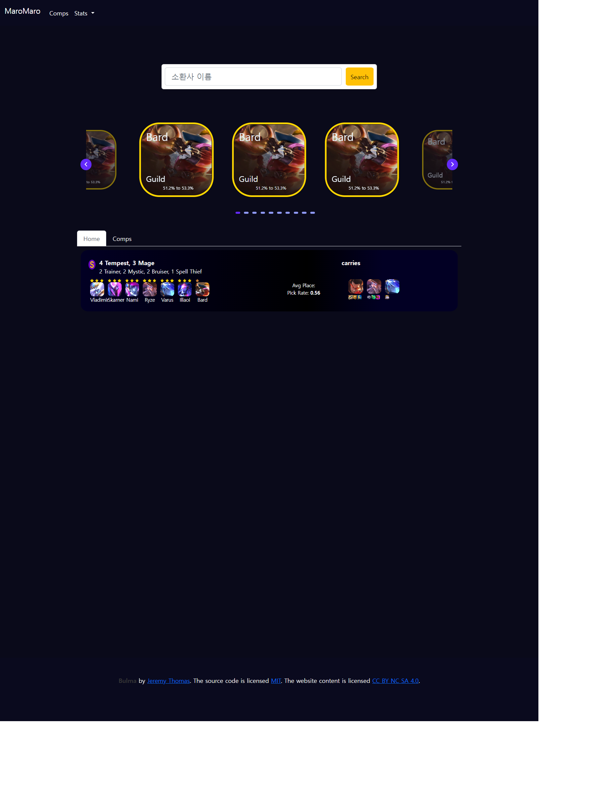

1. 검색기능
   - 유저 닉네임으로 전적을 검색함
2. Hot Champs Cards
   - 최근 패치에 큰 변화가 있는 챔피언들을 카드로 소개
3. Hot Comps
   - 최근 패치이후 S Rank Deck을 소개

## Comps Page

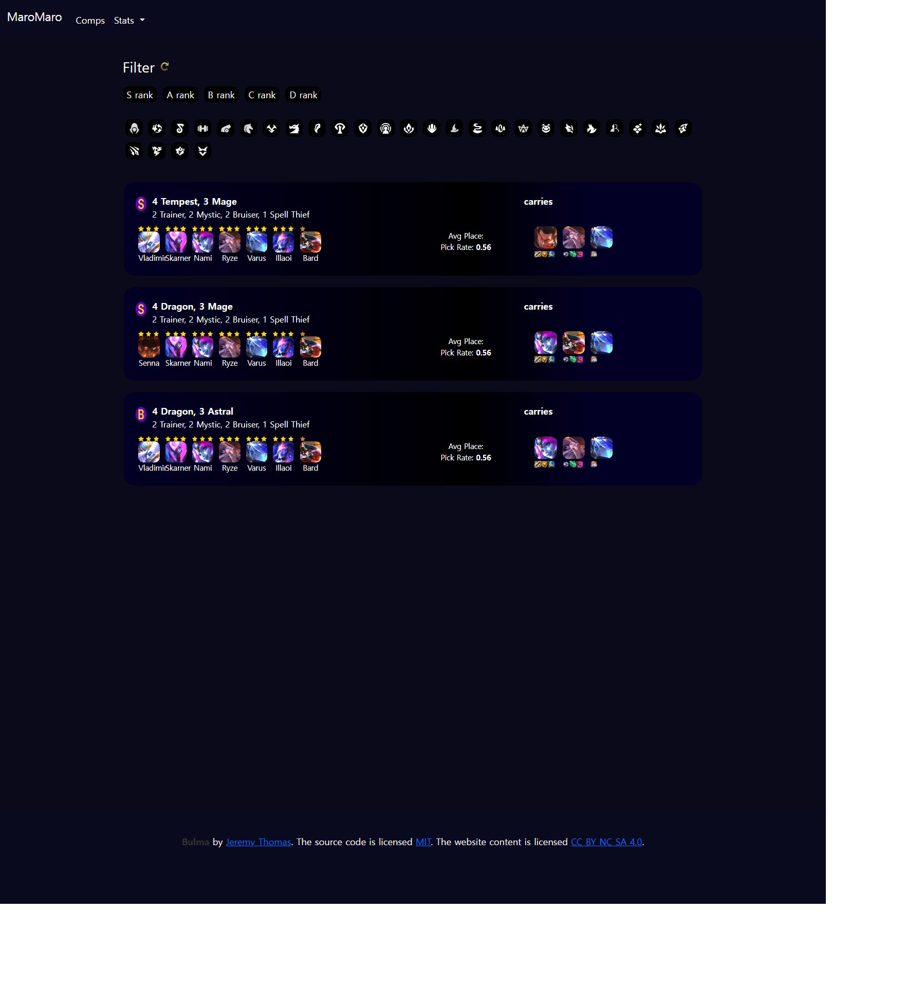

1. 필터기능
   - Traits, Rank로 필터 가능
   - 초기화 기능
2. Rank 순서대로 Deck을 소개
   - 자체 로직으로 만든 Rank
   - 챔피언, Item, Placement, Winrate를 나타냄

## Items Page

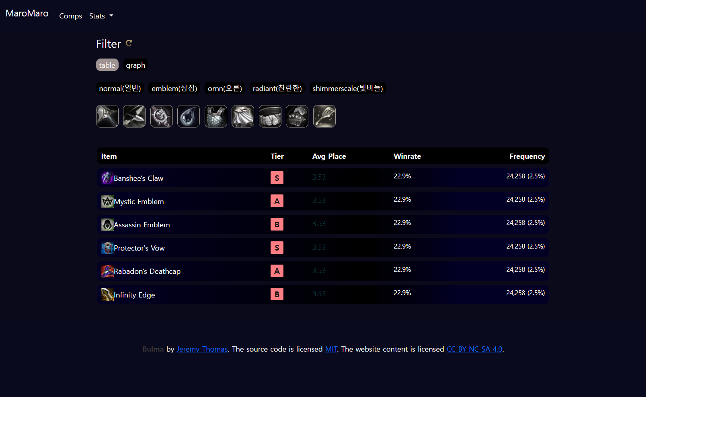

1. 필터기능
  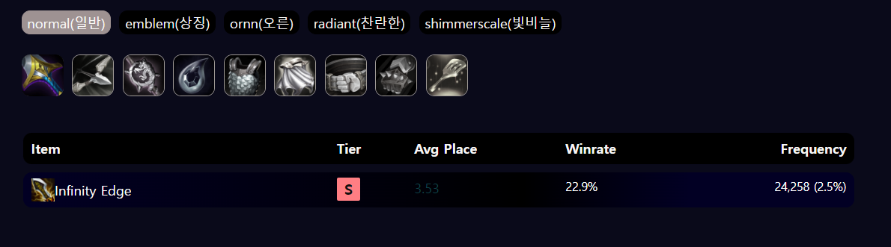
   - Item 종류, 조합 아이템으로 검색 가능
   - 초기화 가능
2. Apex Chart 
  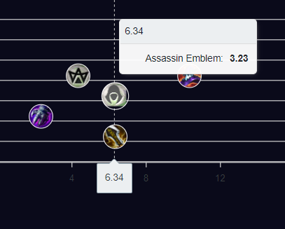
   - 각 item 정보들로 그래프를 그려줌
3. Item Hover/Click
   - Hover 시
   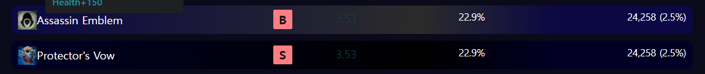
   - Click 시
   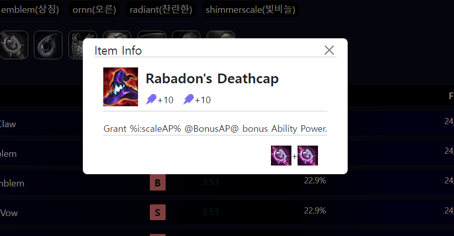

## Units Page

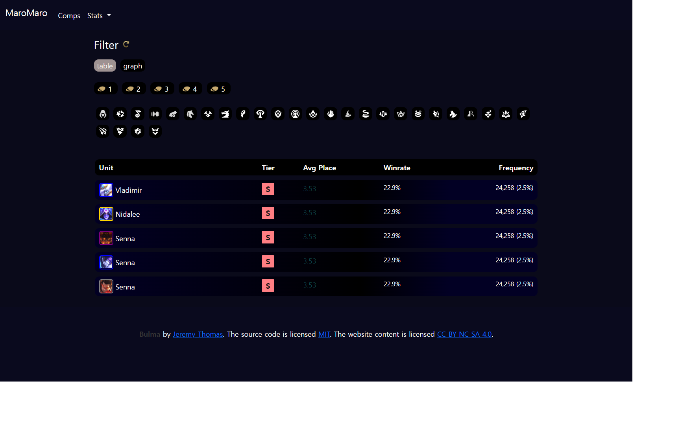

1. 필터기능
  
  - Unit Tratis, Cost로 필터기능
  - Cost는 or 필터, Traits는 And 필터
  - 초기화 가능
2. Apex Chart
   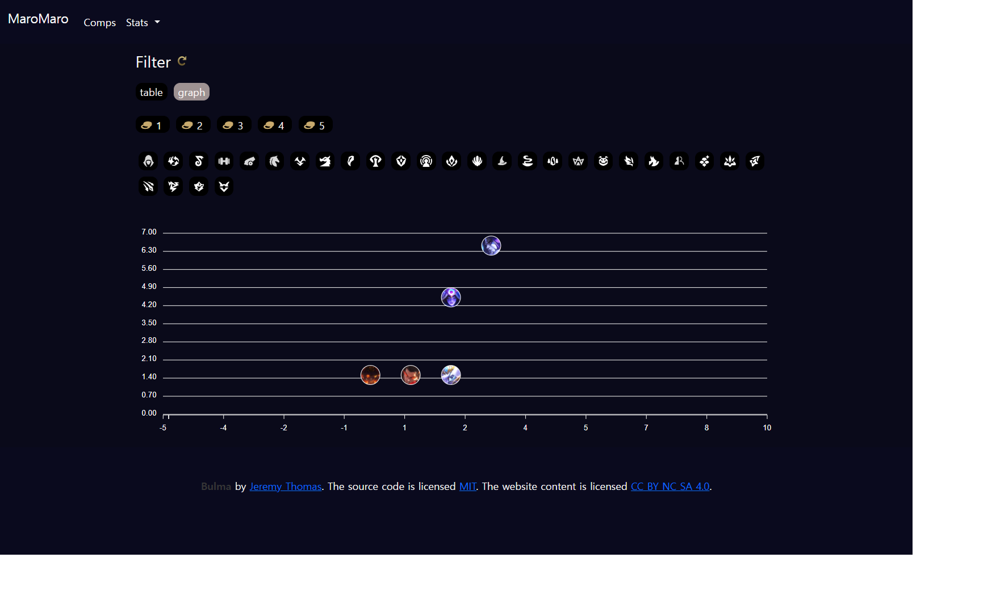
   - hover시 이벤트
   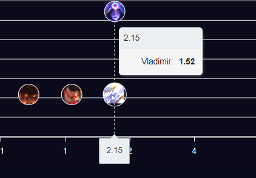
3. Unit Hover/Click
   - Unit Hover
   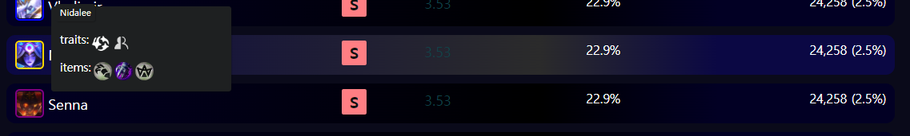
   - Unit Click
   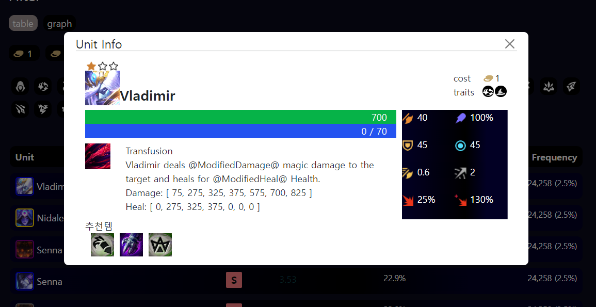
